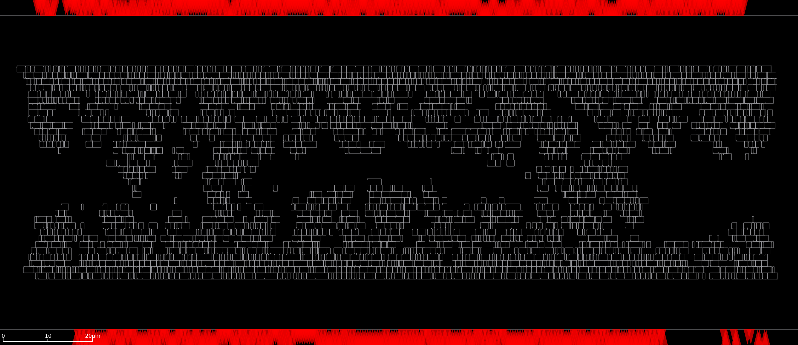
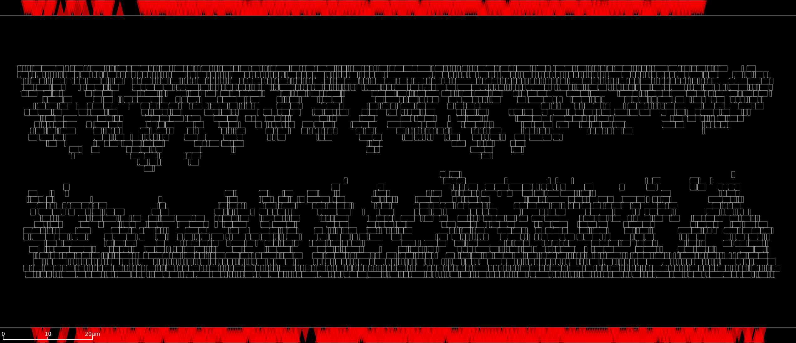
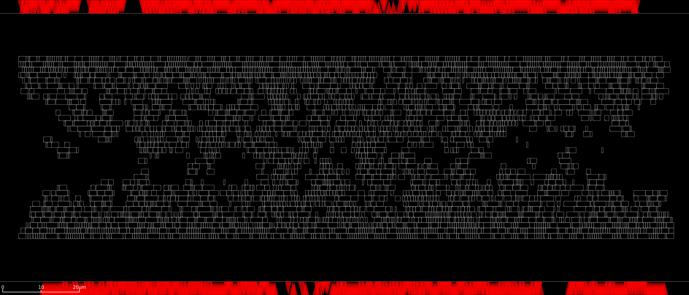

# Example ROHD-based Generator

Build up parallel-prefix circuits using this ROHD-based generator

# Here are some example placements

OpenROAD produces these placements:

256-bit Adder with Sklansky Parallel Prefix Unit

256-bit Adder with Brent-Kung Parallel Prefix Unit

256-bit Adder with Han-Carlson (k=1) Parallel Prefix Unit

256-bit Adder with Kogge-Stone (k=1) Parallel Prefix Unit

~
